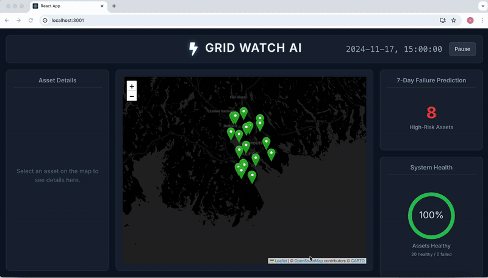

# ⚡ Grid-Watch AI — Halifax Power Assets Dashboard

> A full-stack demo that forecasts power-asset failures in Halifax, NS  
> *Weather-driven simulation · XGBoost prediction · Postgres · PostgREST · React / Leaflet*

---

## 📐 Architecture Overview
             [Raw Weather CSV]         [Simulated 20× Asset CSV]
                      |                         |
                      +-----------+-------------+
                                  |
                                  v
                       +-----------------------+
                       |  XGBoost Training     |  (Jan–Oct)
                       +-----------------------+
                                  |
                     (Nov–Dec failure probability)
                                  |
                                  v
    +--------------------------------------------------------+
    | PostgreSQL (local)                                     |
    |  • weather_hourly      • grid_assets                   |
    |  • sensor_readings     • asset_predictions             |
    +-------------------------------+------------------------+
                                    |  PostgREST REST API
                                    |  (localhost:3000)
                                    v
    +--------------------------------------------------------+
    | React Dashboard (Vite)                                 |
    |  • Title bar w/ sim-clock                              |
    |  • Leaflet map & live markers                          |
    |  • Asset detail panel (30-day volts + today gauge)     |
    |  • 7-day failure summary                               |
    |  • System-health circular gauge                        |
    +--------------------------------------------------------+

---

## 🔧 Tech Stack

| Layer        | Tech / Libs                                  |
|--------------|----------------------------------------------|
| **Data**     | Canadian Gov weather, Python (simulation)    |
| **ML**       | XGBoost, scikit-learn                        |
| **Database** | PostgreSQL                                   |
| **API**      | PostgREST                                    |
| **Front-end**| React, Leaflet, Recharts                     |

---

## Demo PNG

---

## Demo GIF

